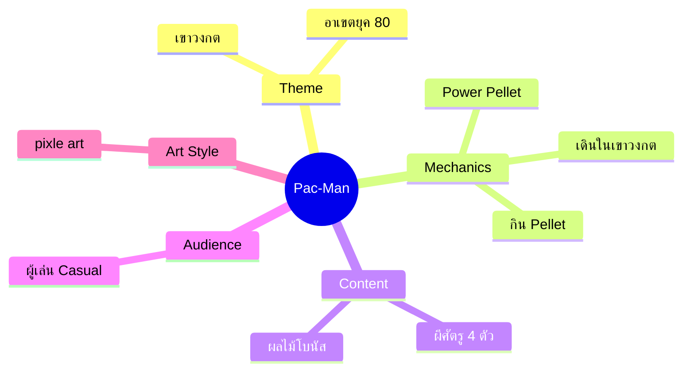
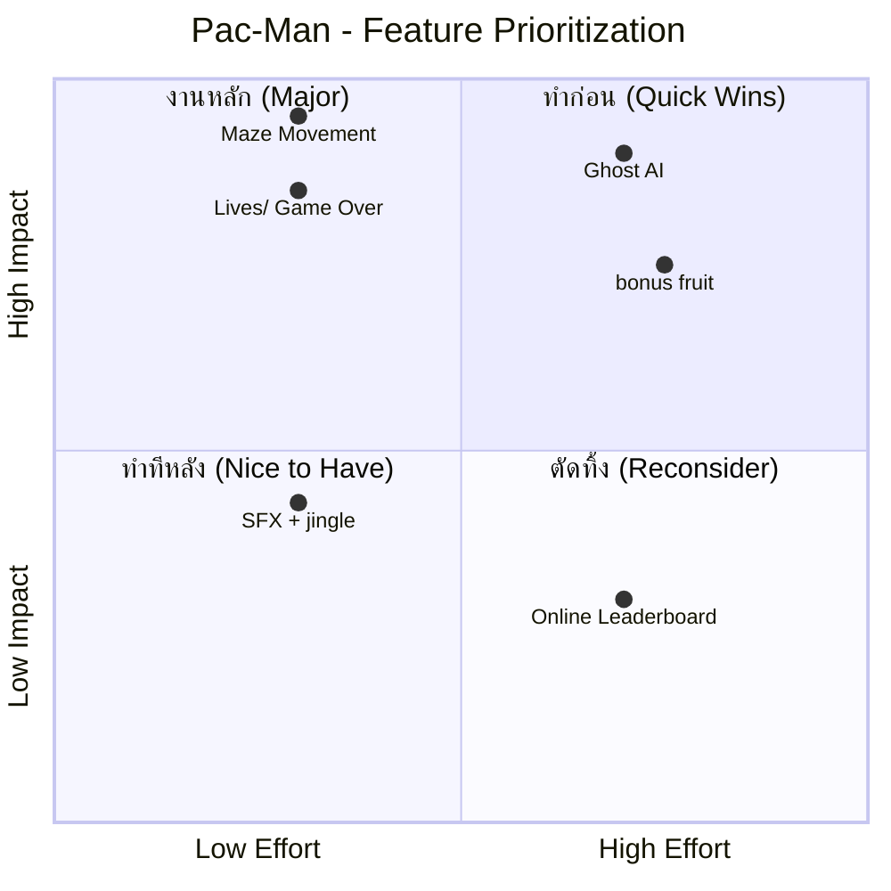
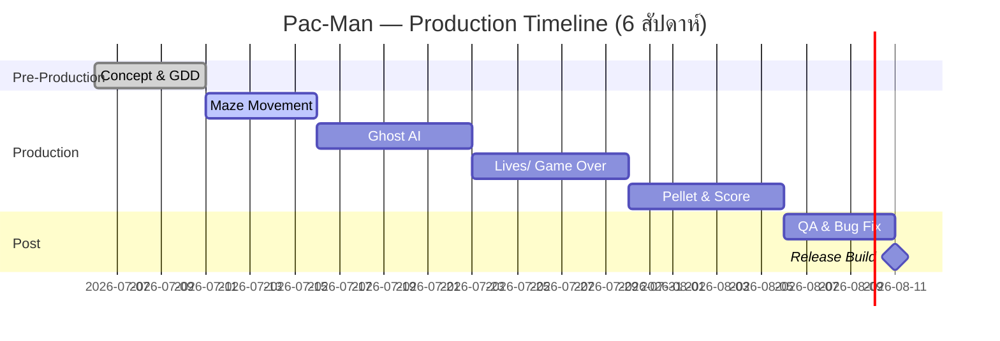

```mermaid
mindmap
root((Pac-Man))
 Theme
   เขาวงกต
   อาเขตยุค 80
 Mechanics
   เดินในเขาวงกต
   กิน Pellet
   Power Pellet
 Content
   ผีศัตรู 4 ตัว
   ผลไม้โบนัส
 Audience
   ผู้เล่น Casual
 Art Style
   pixle art
```

```mermaid

quadrantChart
    title Pac-Man - Feature Prioritization
    x-axis Low Effort --> High Effort
    y-axis Low Impact --> High Impact
    quadrant-1 "ทำก่อน (Quick Wins)"
    quadrant-2 "งานหลัก (Major)"
    quadrant-3 "ทำทีหลัง (Nice to Have)"
    quadrant-4 "ตัดทิ้ง (Reconsider)"
    Maze Movement: [0.3, 0.95]
    Ghost AI: [0.7, 0.9]
    Online Leaderboard: [0.7, 0.3]
    Lives/ Game Over: [0.3, 0.85]
    bonus fruit: [0.75, 0.75]
    SFX + jingle: [0.3, 0.43]
```

```mermaid
gantt
title Pac-Man — Production Timeline (6 สัปดาห์)
dateFormat YYYY-MM-DD
section Pre-Production
Concept & GDD :done, c1, 2026-07-06, 5d
section Production
Maze Movement :active, p1, after c1, 5d
Ghost AI : p2, after p1, 7d
Lives/ Game Over: p3, after p2, 7d
Pellet & Score : p4, after p3, 7d
section Post
QA & Bug Fix : q1, after p4, 5d
Release Build :milestone, m1, after q1, 0d
```

feature

ที่ควรอยู่ในมุมบนซ้ายมี Maze Movement และ Lives/ Game Over

ที่ควรอยู่ในขวาบน Ghost AI และ bonus fruit

ส่วน SFX + jingle และ Online Leaderboard อยู่ในทำทีหลังและตัดทิ้ง
